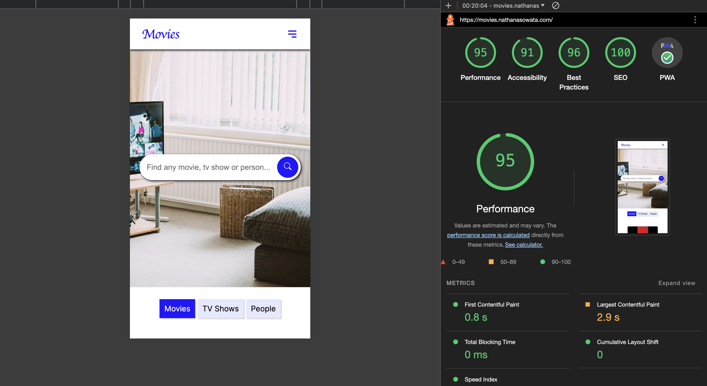

<h1 align="center">Progressive Web App (PWA) to find details about Movies, TV Shows and People</h1>

Formatted with BiomeJS, tested with Vitest and Cypress 🎗

<h3 align="center">
  <a href="https://movies.nathanasowata.com/">Visit the live app</a> 
</h3>

## About this project 📝

I am a frontend developer focusing on React and it's ecosystem. I built this project to demonstrate my skills at this time. It is intended to demonstrate problem-solving encountered when building real-world web apps including server-side data fetching, state management, custom form validation, testing, responsive UI, and more. 
 

## Project structure 🗺️

- `__test__` Contains unit tests for all components. These test are written with _vitest_ and _@testing-library/react_
- `cypress` Contains all end-to-end tests which I have written with _cypress_.
- `src/app` Contains all the pages that make up this application.
- `src/app/api` Contains server-side custom API endpoints.
- `src/components` Contains all reusable components.
- `src/utils` Contains utility files like custom functions and types used across the project. 

## How I built this project ⌨️

- I used NextJS 14 with the App router to set up the project.
- Data used in this project was provided by [TheMovieDB.org](https://developer.themoviedb.org/ "TMDB API Docs") API
- For styling, I used SCSS modules which helped me avoid naming clashes.
- At this time next lint does not work with this version of nextjs so I used biomejs for code formatting.
- I used icons that I accessed through react-icons. 
- For unit testing, I use Vitest with react-testing-library.
- And I used cypress for end-to-end testing.

## Scripts
- `dev` - Starts the development server
- `format` - Runs code formatting on every file in `src`, `cypress`, and `__test__` folders
- `test` - Runs all unit tests with Vitest
- `cypress:open` - Opens Cypress and runs the e2e tests.

## License

[MIT](https://opensource.org/licenses/MIT)

<h3 align="center">
  <a href="https://movies.nathanasowata.com/">Visit the live app</a> 
</h3>
